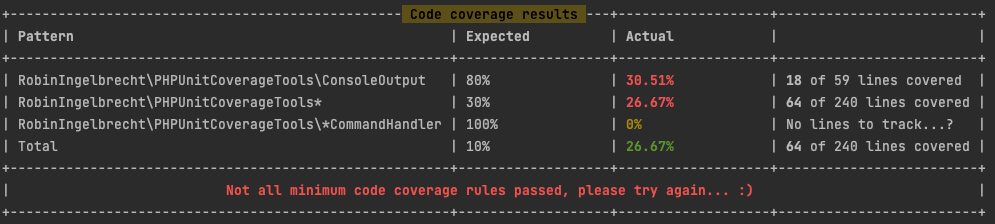
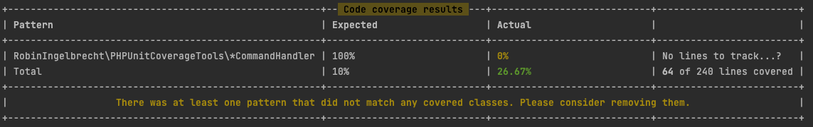

<h1 align="center">PHPUnit Coverage tools</h1>

<p align="center">
<a href="https://github.com/robiningelbrecht/phpunit-coverage-tools/actions/workflows/ci.yml"></a>
<a href="https://github.com/robiningelbrecht/phpunit-coverage-tools/blob/master/LICENSE"></a>
<a href="https://codecov.io/gh/robiningelbrecht/phpunit-coverage-tools"></a>
<a href="https://phpstan.org/"></a>
<a href="https://php.net/"></a>
<a href="https://phpunit.de/"></a>
<a href="https://github.com/robiningelbrecht/phpunit-coverage-tools"></a>
</p>

---

This extension allows you to enforce minimum code coverage by using the clover xml report from PHPUnit. 
Based on the given threshold the testsuite will exit ok if the coverage is higher than the threshold 
or exit with code 1 if the coverage is lower than the threshold. 
This can be used in your continuous deployment environment or can be added to a pre-commit hook.

## Installation

```bash
> composer require robiningelbrecht/phpunit-coverage-tools --dev
```

## Configuration

Navigate to your `phpunit.xml.dist` file and add following config to set default options:

```xml
<extensions>
    <bootstrap class="RobinIngelbrecht\PHPUnitCoverageTools\PhpUnitExtension">
        <parameter name="exitOnLowCoverage" value="0|1"/>
        <parameter name="cleanUpCloverXml" value="0|1"/>
    </bootstrap>
</extensions>
```
## Usage

Just run your testsuite like you normally would, but add following arguments:

### --min-coverage=`[INTEGER]`

```bash
> vendor/bin/phpunit --coverage-clover=path/to/clover.xml -d --min-coverage=100
```

When assigning an integer between 0 - 100, you enforce a minimum code coverage 
for all your classes. In other words, the total coverage of your project has to be
higher than this threshold.

### --min-coverage=`[path/to/min-coverage-rules.php]`

```bash
 > vendor/bin/phpunit --coverage-clover=path/to/clover.xml -d --min-coverage="path/to/min-coverage-rules.php"
```

When referencing a PHP config file, you can configure more complex rules. 
This allows you to be stricter for critical parts of your application and less strict
for parts of your app that are not that critical.

For example:

```php
<?php 

use RobinIngelbrecht\PHPUnitCoverageTools\MinCoverage\MinCoverageRules;

return [
    new MinCoverageRule(
        pattern: MinCoverageRule::TOTAL,
        minCoverage: 20,
        exitOnLowCoverage: true
    ),
    new MinCoverageRule(
        pattern: 'RobinIngelbrecht\PHPUnitCoverageTools\*',
        minCoverage: 80,
        exitOnLowCoverage: false
    ),
    new MinCoverageRule(
        pattern: 'RobinIngelbrecht\PHPUnitCoverageTools\Subscriber\Application\ApplicationFinishedSubscriber',
        minCoverage: 100,
        exitOnLowCoverage: true
    ),   
    new MinCoverageRule(
        pattern: 'RobinIngelbrecht\PHPUnitCoverageTools\*CommandHandler',
        minCoverage: 100,
        exitOnLowCoverage: true
    ),
];
```

This example will enforce:

- A minimum total coverage of *20%*
- A minimum coverage of *80%* for all classes in namespace `RobinIngelbrecht\PHPUnitCoverageTools`, but will NOT `exit = 1` if it fails
- *100%* code coverage for the class `ApplicationFinishedSubscriber`
- *100%* code coverage for the classes ending with `CommandHandler`

### --clean-up-clover-xml

Adding this argument will clean up the generated clover file after the application has finished running.

### Example when coverage is too low



### Example when coverage generates warning



### Example when coverage passes


